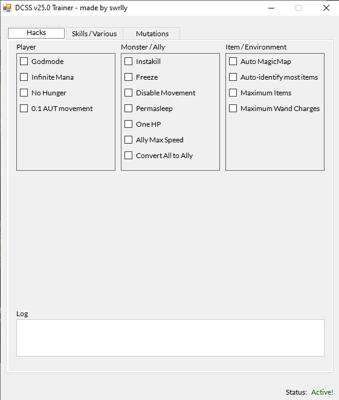

# dcss-trainer

Various hacks for Dungeon Crawl Stone Soup version 0.25.0, an amazing roguelike game. 

<p align="center">

</p>

## Download and Use
Download this project by cloning the repository:

```bash
git clone https://github.com/swrlly/dcss-trainer.git
```

Requirements: 

+ This trainer only supports the installed `tiles` version of crawl. Not the standalone `crawl.exe` version; the installed `crawl-tiles.exe` version.
    - You can find the game [here](https://crawl.develz.org/download.htm) (navigate to `past releases` -> `0.25` -> `win32-installer`).
+ It only supports version 0.25.0; the trainer does not work on other versions of crawl.

Use: 

Run the executable `dcsstrainer.exe`. It will attempt to inject the `src.dll`, which is the actual trainer itself. If successful, the trainer will appear and the console will close.
You can also use any DLL injector to inject `src.dll.`

## Build
* Download MSVC and the following workloads:
    - Desktop development with C++ (also check C++/CLI support as this project mixes C# and C++ code)
    - .NET desktop development
* Open the `.sln` file, you should be good to go. If you run into errors when building the solution, try checking these options:
- linker -> system -> check subsystem windows
- config properties -> advanced
   - CLR support -> enable
   - .NET Target Framework Version -> v4.7.2 (or whatever version you have downloaded before)
   - Enable managed -> Yes

## Features

### Hacks

#### Player
+ Godmode: Sets all incoming damage to your player to 0. Includes magic/poison damage. 
+ Infinite mana: Does not use mana when casting spells.
+ No Hunger: Your hunger does not decrease.
+ 0.1 AUT movement: Be able to move around at 0.1 AUT's. Only applies to movement speed.
+ Set Mutation: You can set any mutation you want (including old version ones).
    - **Warning**: Don't remove mutations that your species come with, otherwise the game will crash.

#### Monster / Ally

+ Instakill: all attacks will instantly kill any monster. Works for ranged/magic/physical.
+ Freeze: Freeze all monsters in place; they will not attack you.
+ Disable movement: Disables monster movement. However, they can still attack. Enemies will physical attacks only will attack themselves. Enemies with ranged and magic attacks can attack you/summon monsters/etc.
    - Note: You should probably use freeze instead if you have allies. Your allies will end up killing themselves (might add an ally ignore later)
+ One HP: Sets all monster HP to one.
+ Ally Max Speed: Set your allies' speed to 99.
+ Convert All to Ally: Every enemy on the level will become your ally, including uniques.

One HP and Freeze will not apply to your allies.

#### Misc
+ Auto-Magic Map: will magic map your level after one tick has passed after you enter a new level.
+ Auto-identify items: Items in your inventory and environment will be automatically identified. Currently does not include shop items.
+ Maximum items: Sets all useable items to 35212 (close to the max).
+ Maximum wand charges: Sets all wand uses to 35212.

### Stats

All missing/invalid values are set to your current values.

+ Change strength, intelligence, dex values: Set them to values between 0 and 127. 
+ Change skill levels: Set them to skill levels between 0.0 and 27.0. Currently doesn't account for race aptitudes.
+ Piety: Set it to a number between 0 and 255.
+ Gold: Set it to a number between 0 and 999,999,999 (don't include commas). 

## Credits
+ [GuidedHacking](https://guidedhacking.com/) for the great tutorials. Check them out if you wish to hack games.
+ [Cheat Engine](https://github.com/cheat-engine/cheat-engine/) for reversing the game functions / memory.
+ The Crawl team for making a great game.

## Bugs / Todo
+ If you close the trainer, you need to restart the game before reinjecting. Need to figure out how to properly eject dll.
+ Instakill doesn't instakill giant uniques
